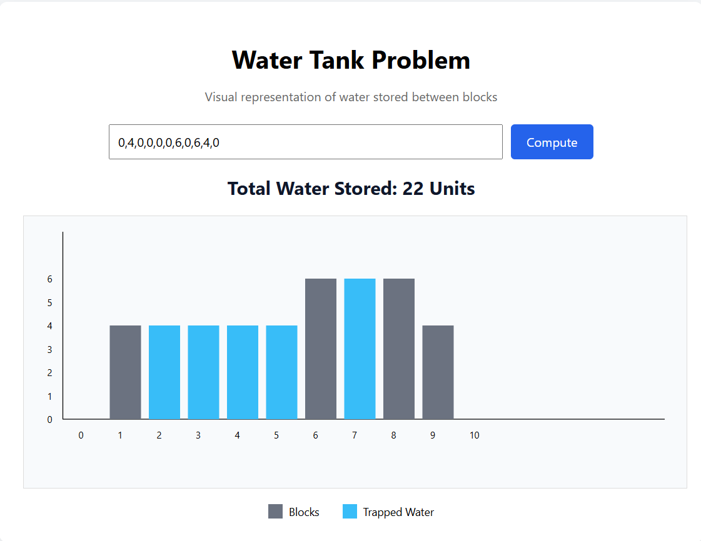

# Water Tank Problem – Rainwater Trapping Visualization

## Live Demo (Local)

🔗 **[Click here to run the Water Tank Problem](http://127.0.0.1:5500/water-tank/index.html)**

> ⚠️ **Note:** This link works only when the project is run locally using VS Code Live Server.

---

## Project Overview

This project is a **frontend web application** that solves and visualizes the classic **Rainwater Trapping (Water Tank) Problem**. Given an array of block heights, the application computes how many units of water are trapped between the blocks after rainfall and displays the result using an **interactive SVG-based visualization**.

The goal is not just to compute the answer, but to **clearly demonstrate how and where water is accumulated** between blocks in a clean, production-ready UI.

---

## Problem Statement

Given an array of non-negative integers representing block heights, compute the **total units of water trapped between the blocks**.

### Example

**Input**

```
[0, 4, 0, 0, 0, 6, 0, 6, 4, 0]
```

**Output**

```
18 Units
```

---

## Sample Input & Visualization



This visual shows:

* Gray blocks representing heights
* Blue blocks representing trapped water
* X-axis → block index
* Y-axis → block height

---

## Solution Approach

### Algorithm Used: Two-Pointer Technique

The application uses an **O(n) time complexity** two-pointer approach:

* Two pointers (`left`, `right`) traverse the array
* Track maximum heights from both ends:

  * `leftMax`
  * `rightMax`
* Water trapped at each position:

```
water = min(leftMax, rightMax) - height[i]
```

### Why this approach?

* ✅ Linear time complexity
* ✅ Constant extra space
* ✅ Optimal for large inputs

---

## Visualization Technique

* Built using **SVG (Scalable Vector Graphics)**
* Each block is rendered as a rectangle
* Trapped water is rendered above blocks in a different color
* Axes are dynamically generated
* Visualization auto-scales based on maximum height

### Legend

* 🟦 **Blue** → Trapped Water
* ⬜ **Gray** → Blocks

---

## Technology Stack

* **HTML5** – Structure
* **CSS3** – Styling and layout
* **Vanilla JavaScript** – Logic and DOM manipulation
* **SVG** – Visualization

> ❌ No frameworks or external libraries used

---

## Project Structure

```
water-tank/
│
├── index.html     # UI structure
├── style.css      # Styling and layout
├── script.js      # Algorithm logic & SVG rendering
└── README.md      # Project documentation
```

---

## How to Run the Application

### Option 1: Live Server (Recommended)

1. Open the `water-tank` folder in **VS Code**
2. Right-click on `index.html`
3. Select **Open with Live Server**
4. Enter input values and click **Compute**

### Option 2: Direct Browser Open

1. Double-click `index.html`
2. Open it in any modern browser
3. Enter input values and click **Compute**

---

## Input Validation

The application includes basic input validation:

* ❗ Empty input → prompts user to enter values
* ❗ Non-numeric values → shows an error alert
* ✔ Accepts only comma-separated numbers

This ensures robustness and prevents incorrect calculations.

---

## Key Features

* ✅ Interactive input handling
* ✅ Real-time trapped water calculation
* ✅ SVG-based scalable visualization
* ✅ Axes, legend, and labels for clarity
* ✅ Efficient O(n) algorithm
* ✅ Clean and maintainable frontend code

---

## Learning Outcomes

* Strong understanding of the **Rainwater Trapping algorithm**
* Experience in **algorithm visualization**
* Hands-on SVG rendering using JavaScript
* Frontend engineering without frameworks
* Writing production-quality UI logic

---

## Future Enhancements (Optional)

* Animated water-filling effect
* Mobile responsiveness
* Step-by-step algorithm animation
* Support for random or generated inputs

---

## Conclusion

This project successfully transforms an algorithmic problem into a **clear, interactive, and visually intuitive web application**. It demonstrates both **problem-solving skills** and **frontend engineering proficiency**, making it well-suited for technical evaluations and portfolio showcasing.
